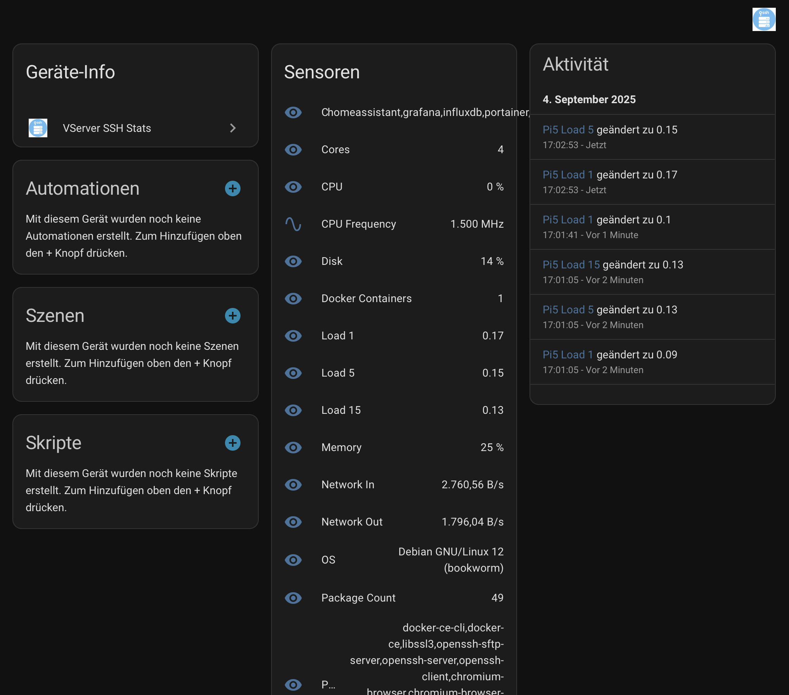

# VServer SSH Stats – Home Assistant Integration


## Übersicht
Die **VServer SSH Stats** Integration für Home Assistant ermöglicht die Überwachung entfernter Linux-Server (vServer, Raspberry Pi oder dedizierte Maschinen), ohne zusätzliche Agenten auf den Zielrechnern zu installieren.

Die Integration verbindet sich per **SSH** (über IP-Adresse, Benutzername und Passwort oder SSH-Schlüssel) und sammelt Systemmetriken direkt aus `/proc`, `df` und anderen Standard-Linux-Schnittstellen. Die Werte erscheinen als native Sensoren in Home Assistant.

So lassen sich CPU-, Speicher-, Festplatten-, Laufzeit-, Netzwerkdurchsatz- und Temperaturinformationen in Echtzeit in Home Assistant Dashboards anzeigen.

Die Integration stellt außerdem Home-Assistant-Dienste bereit, um ad-hoc Befehle auf den Servern auszuführen.

---

## Funktionen
- Keine Softwareinstallation auf dem Zielserver erforderlich (nur SSH-Zugriff).
- Unterstützt mehrere Server mit individueller Konfiguration.
- Konfiguration über die Home Assistant Oberfläche (Config Flow).
- Unterstützt Passwort- und SSH-Schlüssel-Authentifizierung.
- Home-Assistant-Services und Schaltflächen zum Ausführen von Befehlen, Paket-Updates und Reboots.
- Automatische Erkennung von SSH-fähigen Hosts im lokalen Netzwerk zur schnellen Einrichtung, manuelle Konfiguration bleibt weiterhin möglich. Kompatible Server, die sich per Zeroconf ankündigen, erscheinen außerdem im Bereich **Entdeckt** von Home Assistant.
- Sammelt:
  - CPU-Auslastung (%)
  - Speicherauslastung (%)
  - Gesamter RAM (MB)
  - Festplattenauslastung (% für `/`)
  - Netzwerkdurchsatz (Bytes/s, ein- und ausgehend)
  - Laufzeit (Sekunden)
  - Temperatur (°C, falls verfügbar)
  - CPU-Kerne
  - Last (1/5/15 Minuten)
  - CPU-Frequenz (MHz)
  - Betriebssystem-Version
  - Installierte Pakete (Anzahl und Liste)
  - Docker-Installation, laufende Container und Auslastung einzelner Container (CPU und Speicher)
  - Automatische Erstellung neuer CPU- und Speichersensoren, sobald zusätzliche Container starten
  - VNC-Unterstützung
  - HTTP/HTTPS-Webserver-Status
  - SSH aktiviert
- Konfigurierbares Aktualisierungsintervall (Standard: 30 Sekunden).
- Dienste zum Abrufen der lokalen IP-Adresse, der Uptime, Liste aktiver SSH-Verbindungen, zum Ausführen von Befehlen, Aktualisieren von Paketen und Neustarten des Hosts.

## Dienste & Events

Die Integration stellt Home-Assistant-Dienste für Remote-Aktionen bereit:

- `vserver_ssh_stats.get_local_ip` – Lokale IP-Adresse des Servers abrufen.
- `vserver_ssh_stats.get_uptime` – Uptime in Sekunden abrufen.
- `vserver_ssh_stats.list_connections` – Aktive SSH-Sitzungen auflisten.
- `vserver_ssh_stats.run_command` – Beliebigen Shell-Befehl remote ausführen.
- `vserver_ssh_stats.update_packages` – Systempakete aktualisieren (apt/dnf/yum).
- `vserver_ssh_stats.reboot_host` – Den Remote-Host neu starten.

Nach Abschluss von `update_packages` wird das Event `vserver_ssh_stats_update_packages` auf dem Home-Assistant-Event-Bus
ausgelöst. Die Ausgabe des Befehls ist im Payload enthalten und kann z. B. für Benachrichtigungen oder Folgeaktionen genutzt werden.

## Unterstützung

Wenn dir die Integration hilft, freue ich mich über eine Spende:

[PayPal – Spenden](https://www.paypal.com/paypalme/TonyBrueser)

Vielen Dank für deine Unterstützung! Jede Spende hilft, das Projekt weiterzuentwickeln.

---

## Installation

### Über HACS (Home Assistant Community Store)
1. Stelle sicher, dass [HACS](https://hacs.xyz) in Home Assistant installiert ist.
2. Füge in HACS `https://github.com/404GamerNotFound/vserver-ssh-stats` als benutzerdefiniertes Repository (Typ: Integration) hinzu.
3. Suche nach **VServer SSH Stats** und installiere die Integration.
4. Starte Home Assistant neu, um die neue Integration zu laden.

Beispiel aus HACS:



## Erstellte Entitäten

Für jeden Server sind folgende Entitäten verfügbar:

- `sensor.<name>_cpu` – CPU-Auslastung (%)
- `sensor.<name>_mem` – Speicherauslastung (%)
- `sensor.<name>_disk` – Festplattenauslastung (%)
- `sensor.<name>_net_in` – Netzwerkeingang (Bytes/s)
- `sensor.<name>_net_out` – Netzwerkausgang (Bytes/s)
- `sensor.<name>_uptime` – Laufzeit (Sekunden)
- `sensor.<name>_temp` – Temperatur (°C, falls verfügbar)
- `sensor.<name>_ram` – Gesamt-RAM (MB)
- `sensor.<name>_cores` – CPU-Kerne
- `sensor.<name>_load_1` – 1‑Minuten‑Last
- `sensor.<name>_load_5` – 5‑Minuten‑Last
- `sensor.<name>_load_15` – 15‑Minuten‑Last
- `sensor.<name>_cpu_freq` – CPU‑Frequenz (MHz)
- `sensor.<name>_os` – Betriebssystem-Version
- `sensor.<name>_pkg_count` – Anzahl verfügbarer Updates
- `sensor.<name>_pkg_list` – Verfügbare Updates (erste 10)
- `sensor.<name>_docker` – 1, wenn Docker installiert ist, sonst 0
- `sensor.<name>_containers` – Laufende Docker-Container (kommagetrennte Liste)
- `sensor.<name>_vnc` – "ja", wenn ein VNC-Server erkannt wurde
- `sensor.<name>_web` – "ja", wenn ein HTTP- oder HTTPS-Dienst lauscht
- `sensor.<name>_ssh` – "ja", wenn der SSH-Dienst lauscht
- Für jeden laufenden Container: `sensor.<name>_container_<container>_cpu` (CPU-Auslastung %) und `sensor.<name>_container_<container>_mem` (Speicherauslastung %)

---

## Beispiel für ein Lovelace-Dashboard

```yaml
type: vertical-stack
cards:
  - type: gauge
    name: VPS1 CPU
    entity: sensor.vps1_cpu
  - type: gauge
    name: VPS1 Memory
    entity: sensor.vps1_mem
  - type: entities
    title: VPS1 Details
    entities:
      - sensor.vps1_disk
      - sensor.vps1_net_in
      - sensor.vps1_net_out
      - sensor.vps1_uptime
      - sensor.vps1_temp
```

## Ablage des SSH-Schlüssels

- Unter **Home Assistant OS** die private SSH-Schlüsseldatei in das Verzeichnis `/config/ssh/` kopieren (z. B. über das File-
  Editor-Add-on oder die Samba-Freigabe). Ein Schlüssel `id_vserver` landet so unter `/config/ssh/id_vserver`.
- Im Konfigurationsassistenten entweder den absoluten Pfad `/config/ssh/id_vserver` oder den relativen Pfad `ssh/id_vserver`
  (ausgehend vom Home-Assistant-Konfigurationsordner) eintragen. Beide Varianten werden unterstützt.
- Es muss immer die **private** Schlüsseldatei angegeben werden, nicht die `.pub`-Datei.
- Bei Home Assistant Container/Core kann auch ein beliebiger absoluter Pfad verwendet werden, auf den Home Assistant zugreifen
  darf.

## Sicherheitshinweise
- Es wird empfohlen, einen dedizierten, eingeschränkten Benutzer für das SSH-Monitoring zu erstellen (mit nur Lesezugriff auf `/proc` und `df`).
- SSH-Passwortauthentifizierung wird unterstützt, aber **SSH-Schlüssel-Authentifizierung** wird für den produktiven Einsatz dringend empfohlen.
- Remote-Aktionen wie Paketaktualisierungen und Neustarts nutzen `sudo`. Stellen Sie sicher, dass das entfernte Konto `apt-get`, `dnf`, `yum` und `reboot` ohne Passwortabfrage ausführen darf (z. B. durch gezielte Einträge in der `/etc/sudoers`). Dokumentieren oder härten Sie diese Rechte pro Server ab, bevor Sie die Buttons/Services einsetzen.

---

## Release-Management
- Aktuelle stabile Version: **v1.2.10** (siehe `manifest.json`).
- Erstellen Sie für jede veröffentlichte Version ein Git-Tag (z. B. `git tag v1.2.10`) sowie ein zugehöriges GitHub-Release, damit HACS Updates sauber nachvollziehen kann.
- Nutzen Sie das vorhandene Skript `scripts/bump_version.py`, um die Versionsnummer der Integration vor einer neuen Veröffentlichung zu erhöhen.
- Pflegen Sie wichtige Änderungen zusätzlich in der [`CHANGELOG.md`](CHANGELOG.md).

---

## Anforderungen
- Home Assistant.
- SSH-Zugang zu den überwachten Servern.
- Linux-basierte Zielserver (beliebige Distribution mit `/proc` und `df`).

---

## Lizenz
Dieses Projekt ist unter der **MIT-Lizenz** lizenziert.

---

## Autor
**Tony Brüser**
Originalautor und Maintainer dieser Integration.
