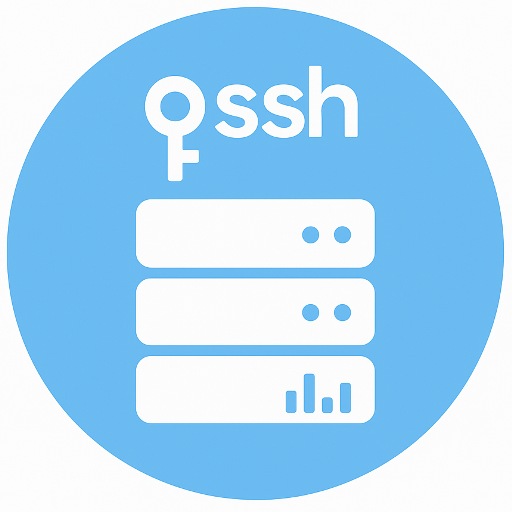
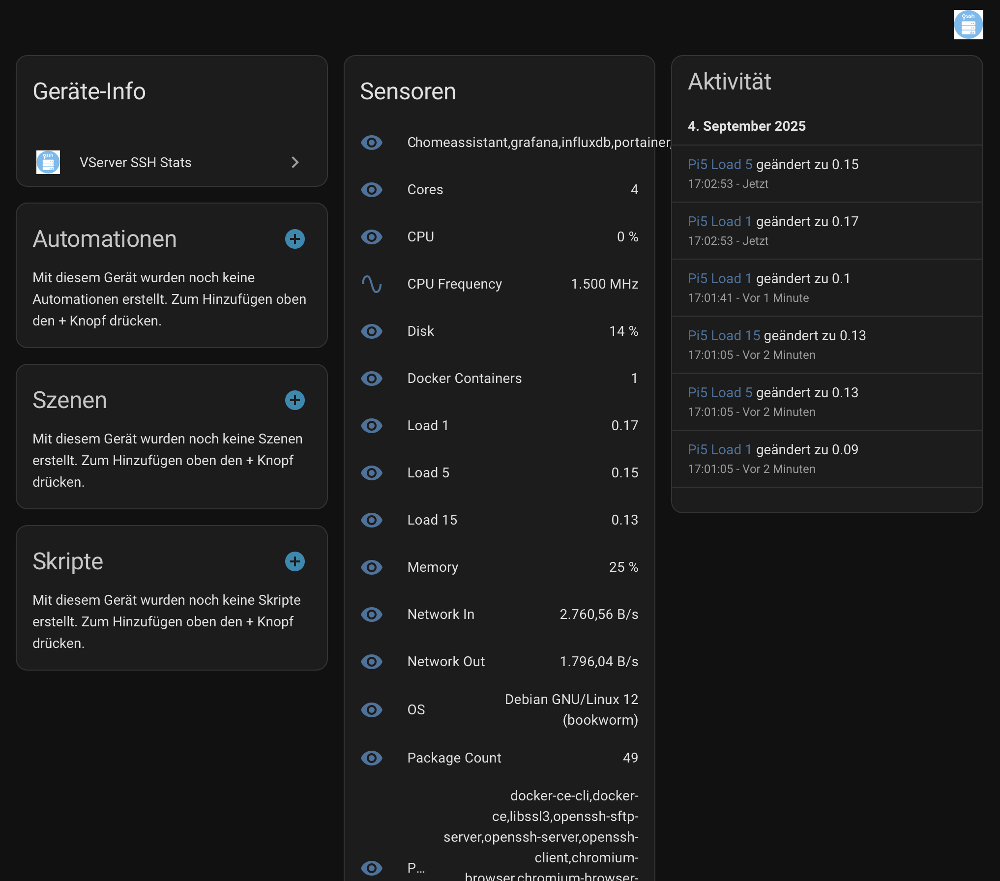

# VServer SSH Stats – Integración de Home Assistant

[Deutsch](README.de.md) | [English](README.md) | [Français](README.fr.md)



## Descripción general
La **integración VServer SSH Stats** para Home Assistant te permite supervisar servidores Linux remotos (vServers, Raspberry Pi o máquinas dedicadas) sin instalar agentes adicionales en las máquinas objetivo.

La integración se conecta mediante **SSH** (usando dirección IP, nombre de usuario y contraseña o clave SSH) y recopila métricas del sistema directamente de `/proc`, `df` y otras interfaces estándar de Linux. Las métricas aparecen como sensores nativos en Home Assistant.

Esto permite obtener información en tiempo real sobre CPU, memoria, disco, tiempo de actividad, rendimiento de red y temperatura de todos tus servidores en los paneles de Home Assistant.

La integración también proporciona servicios de Home Assistant para ejecutar comandos ad hoc en tus servidores.

---

## Características
- No se requiere instalación de software en el servidor de destino (solo acceso SSH).
- Soporta múltiples servidores con configuración individual.
- Configurable a través de la interfaz de Home Assistant (config flow).
- Soporta autenticación por contraseña y por clave SSH.
- Servicios de Home Assistant y entidades de botón para ejecutar comandos remotos, actualizar paquetes y reiniciar.
- Detecta automáticamente hosts con SSH en la red local para una configuración rápida, manteniendo la posibilidad de configuración manual. Los servidores compatibles que se anuncian mediante Zeroconf también aparecen en la sección **Descubierto** de Home Assistant.
- Recopila:
  - Uso de CPU (%)
  - Uso de memoria (%)
  - Uso de swap (%)
  - Swap total (GiB)
  - RAM total (MB)
  - Uso de disco (% para `/`)
  - Rendimiento de red (bytes/s de entrada y salida)
  - Tiempo de actividad (segundos)
  - Temperatura (°C, si está disponible)
  - Núcleos de CPU
  - Carga promedio (1/5/15 min)
  - Frecuencia de CPU (MHz)
  - Versión del sistema operativo
  - Paquetes instalados (cantidad y lista)
  - Detección de Docker, contenedores en ejecución y uso por contenedor (CPU y memoria)
  - Creación automática de sensores de CPU y memoria por contenedor cuando se detectan nuevos contenedores
  - Estado de soporte VNC
  - Estado de servidor web HTTP/HTTPS
  - Estado de servicio SSH
- Intervalo de actualización configurable (por defecto: 30 segundos).
- Servicios para obtener la IP local del servidor, el tiempo de actividad, listar conexiones SSH activas, ejecutar comandos, actualizar paquetes y reiniciar el host.

## Servicios y eventos

La integración expone servicios de Home Assistant para acciones remotas:

- `vserver_ssh_stats.get_local_ip` – Devuelve la IP local del servidor.
- `vserver_ssh_stats.get_uptime` – Devuelve el tiempo de actividad en segundos.
- `vserver_ssh_stats.list_connections` – Lista las sesiones SSH activas.
- `vserver_ssh_stats.run_command` – Ejecuta un comando de shell arbitrario de forma remota.
- `vserver_ssh_stats.update_packages` – Lanza actualizaciones de paquetes del sistema (apt/dnf/yum).
- `vserver_ssh_stats.reboot_host` – Reinicia el host remoto.

Cuando `update_packages` termina, la integración lanza el evento `vserver_ssh_stats_update_packages` en el bus de eventos de Home Assistant con la salida del comando en la carga útil, para automatizar notificaciones o acciones posteriores.

## Apoya el proyecto

Si esta integración te ahorra tiempo, puedes apoyar el desarrollo con una donación:

[PayPal – Donar](https://www.paypal.com/paypalme/TonyBrueser)

¡Gracias por tu apoyo! Cada contribución ayuda a que este proyecto siga avanzando.

---

## Instalación

### A través de HACS (Home Assistant Community Store)
1. Asegúrate de que [HACS](https://hacs.xyz) esté instalado en Home Assistant.
2. En HACS, añade `https://github.com/404GamerNotFound/vserver-ssh-stats` como repositorio personalizado (tipo: integración).
3. Busca **VServer SSH Stats** e instala la integración.
4. Reinicia Home Assistant para cargar la nueva integración.

Ejemplo de HACS:



## Entidades creadas

Para cada servidor estarán disponibles las siguientes entidades:

- `sensor.<name>_cpu` – Uso de CPU (%)
- `sensor.<name>_mem` – Uso de memoria (%)
- `sensor.<name>_swap_usage` – Uso de swap (%)
- `sensor.<name>_swap_total` – Swap total (GiB)
- `sensor.<name>_disk` – Uso de disco (%)
- `sensor.<name>_net_in` – Tráfico de entrada (bytes/s)
- `sensor.<name>_net_out` – Tráfico de salida (bytes/s)
- `sensor.<name>_uptime` – Tiempo de actividad (segundos)
- `sensor.<name>_temp` – Temperatura (°C, si está disponible)
- `sensor.<name>_ram` – RAM total (MB)
- `sensor.<name>_cores` – Núcleos de CPU
- `sensor.<name>_load_1` – Carga promedio 1 min
- `sensor.<name>_load_5` – Carga promedio 5 min
- `sensor.<name>_load_15` – Carga promedio 15 min
- `sensor.<name>_cpu_freq` – Frecuencia de CPU (MHz)
- `sensor.<name>_os` – Versión del sistema operativo
- `sensor.<name>_pkg_count` – Cantidad de actualizaciones pendientes
- `sensor.<name>_pkg_list` – Actualizaciones pendientes (primeras 10)
- `sensor.<name>_docker` – 1 si Docker está instalado, 0 en caso contrario
- `sensor.<name>_containers` – Contenedores Docker en ejecución (lista separada por comas)
- `sensor.<name>_vnc` – "sí" si se detecta un servidor VNC
- `sensor.<name>_web` – "sí" si escucha un servicio HTTP o HTTPS
- `sensor.<name>_ssh` – "sí" si el servicio SSH está activo
- Para cada contenedor en ejecución: `sensor.<name>_container_<container>_cpu` (uso de CPU %) y `sensor.<name>_container_<container>_mem` (uso de memoria %)

---

## Ejemplo de panel Lovelace

```yaml
type: vertical-stack
cards:
  - type: gauge
    name: VPS1 CPU
    entity: sensor.vps1_cpu
  - type: gauge
    name: VPS1 Memory
    entity: sensor.vps1_mem
  - type: entities
    title: VPS1 Details
    entities:
      - sensor.vps1_disk
      - sensor.vps1_net_in
      - sensor.vps1_net_out
      - sensor.vps1_uptime
      - sensor.vps1_temp
```

## Automatizaciones de salud y alertas

Usa los sensores proporcionados para recibir avisos cuando un servidor parezca inestable. Por ejemplo:

- uso alto de CPU o memoria sostenido durante varios minutos;
- discos cerca del límite de capacidad;
- sensores que pasan a `unavailable`/`unknown`, lo que normalmente indica una caída de conectividad SSH.

Puedes copiar y ajustar los ejemplos en [`examples/automations/health_alerts.yaml`](examples/automations/health_alerts.yaml) según tus entidades y servicios de notificación.

## Ubicación de la clave SSH

- En **Home Assistant OS**, copia tu clave privada SSH en el directorio `/config/ssh/` (por ejemplo mediante el complemento File
  Editor o el recurso compartido Samba). Una clave llamada `id_vserver` quedará en `/config/ssh/id_vserver`.
- En el asistente de configuración introduce la ruta absoluta `/config/ssh/id_vserver` o la ruta relativa al directorio de conf
  iguración de Home Assistant, por ejemplo `ssh/id_vserver`. Ambas formas son válidas.
- Indica siempre el archivo de clave **privada**. No uses el archivo público `.pub`.
- En instalaciones Home Assistant Container/Core también puedes proporcionar cualquier ruta absoluta a la que Home Assistant ten
  ga acceso.

## Notas de seguridad
- Se recomienda crear un usuario dedicado y restringido para la supervisión por SSH (con acceso de solo lectura a `/proc` y `df`).
- Debido a la sintaxis de los comandos ejecutados, el usuario remoto debe usar /bin/bash (o un shell compatible); /bin/sh no reconoce ciertas expresiones.
- Se admite autenticación por contraseña, pero se recomienda encarecidamente la **autenticación por clave SSH** para uso en producción.
- Las acciones remotas como las actualizaciones de paquetes y los reinicios usan `sudo`. Asegúrate de que la cuenta remota pueda ejecutar `apt-get`, `dnf`, `yum` y `reboot` sin solicitar contraseña (por ejemplo, añadiendo reglas explícitas en `/etc/sudoers`). Documenta o refuerza esos permisos en cada servidor antes de habilitar los botones/servicios.


Ejemplo de configuración para `/etc/sudoers.d/<tu-usuario-vserver-ssh-stats>`
```
# Usuario de monitorización <tu usuario de VServer SSH Stats>: algunos comandos específicos sin contraseña
<tu usuario vserver> ALL=(root) NOPASSWD: /usr/bin/apt update

# En sistemas de producción reales, evita upgrades automáticos.
# Usa mejor los botones de la interfaz de Home Assistant para mantener el control.
<tu usuario vserver> ALL=(root) NOPASSWD: /usr/bin/apt upgrade
<tu usuario vserver> ALL=(root) NOPASSWD: /sbin/reboot

# Lectura de valores de energía en Ubuntu / Debian recientes (y posiblemente otros)
<tu usuario vserver> ALL=(root) NOPASSWD: /usr/bin/chmod a+r /sys/class/powercap/*/energy_uj
<tu usuario vserver> ALL=(root) NOPASSWD: /usr/bin/chmod a-r /sys/class/powercap/*/energy_uj
```

---

## Gestión de lanzamientos
- Versión estable actual: **v1.2.10** (coincide con `manifest.json`).
- Crea una etiqueta Git (por ejemplo, `git tag v1.2.10`) y una versión en GitHub para cada lanzamiento a fin de que HACS pueda seguir las actualizaciones correctamente.
- Utiliza el script existente `scripts/bump_version.py` para incrementar la versión de la integración al preparar una nueva publicación.
- Registra los cambios relevantes en [`CHANGELOG.md`](CHANGELOG.md) junto con cada versión.

---

## Requisitos
- Home Assistant.
- Acceso SSH a los servidores monitorizados.
- Servidores de destino basados en Linux (cualquier distribución con `/proc` y `df`).

---

## Licencia
Este proyecto está licenciado bajo la **Licencia MIT**.

---

## Autor
**Tony Brüser**
Autor original y mantenedor de esta integración.
