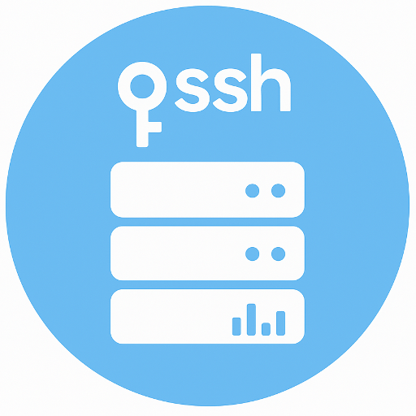
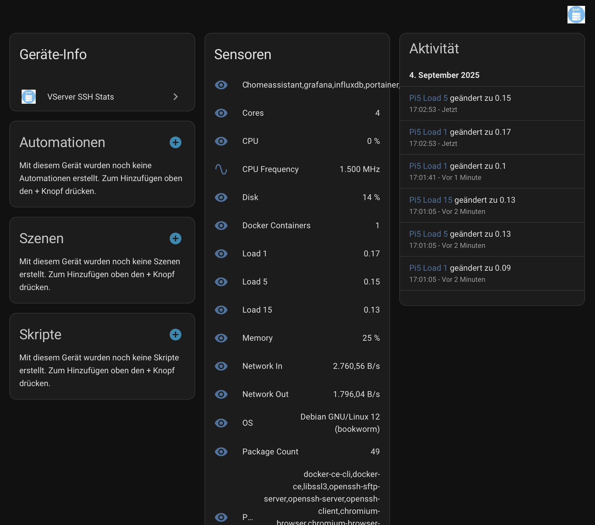

# VServer SSH Stats – Intégration pour Home Assistant



## Vue d'ensemble
L'intégration **VServer SSH Stats** pour Home Assistant permet de surveiller des serveurs Linux distants (vServers, Raspberry Pi ou machines dédiées) sans installer de logiciels supplémentaires sur les machines cibles.

L'intégration se connecte via **SSH** (adresse IP, nom d'utilisateur et mot de passe ou clé SSH) et collecte les métriques système directement depuis `/proc`, `df` et d'autres interfaces Linux standard. Les métriques apparaissent comme des capteurs natifs dans Home Assistant.

Cela permet d'afficher en temps réel les informations de CPU, mémoire, disque, temps de fonctionnement, débit réseau et température de tous vos serveurs dans les tableaux de bord Home Assistant.

L'intégration fournit également des services Home Assistant pour exécuter des commandes ad hoc sur vos serveurs.

---

## Fonctionnalités
- Aucun logiciel à installer sur le serveur cible (simple accès SSH).
- Prise en charge de plusieurs serveurs avec configuration individuelle.
- Configurable via l'interface Home Assistant (config flow).
- Prise en charge de l'authentification par mot de passe et par clé SSH.
- Services Home Assistant et entités bouton pour exécuter des commandes à distance, mettre à jour les paquets et redémarrer.
- Détecte automatiquement les hôtes compatibles SSH sur le réseau local pour une configuration rapide, tout en permettant une configuration manuelle. Les serveurs compatibles s'annonçant via Zeroconf apparaissent également dans la section **Découvert** de Home Assistant.
- Collecte :
  - Utilisation du CPU (%)
  - Utilisation de la mémoire (%)
  - RAM totale (MB)
  - Utilisation du disque (% pour `/`)
  - Débit réseau (octets/s, entrant et sortant)
  - Temps de fonctionnement (secondes)
  - Température (°C, si disponible)
  - Cœurs CPU
  - Charge moyenne (1/5/15 min)
  - Fréquence CPU (MHz)
  - Version du système d'exploitation
  - Paquets installés (nombre et liste)
  - Détection de Docker, conteneurs en cours d'exécution et utilisation par conteneur (CPU et mémoire)
  - Statut du support VNC
  - Statut du serveur web HTTP/HTTPS
  - Statut du service SSH
- Intervalle de mise à jour configurable (par défaut : 30 secondes).
- Services pour obtenir l'adresse IP locale du serveur, le temps de fonctionnement, lister les connexions SSH actives, exécuter des commandes, mettre à jour les paquets et redémarrer l'hôte.

---

## Installation

### Via HACS (Home Assistant Community Store)
1. Assurez-vous que [HACS](https://hacs.xyz) est installé dans Home Assistant.
2. Dans HACS, ajoutez `https://github.com/404GamerNotFound/vserver-ssh-stats` comme dépôt personnalisé (type : integration).
3. Recherchez **VServer SSH Stats** et installez l'intégration.
4. Redémarrez Home Assistant pour charger la nouvelle intégration.

Exemple depuis HACS :



## Entités créées

Pour chaque serveur, les entités suivantes seront disponibles :

- `sensor.<name>_cpu` – Utilisation du CPU (%)
- `sensor.<name>_mem` – Utilisation de la mémoire (%)
- `sensor.<name>_disk` – Utilisation du disque (%)
- `sensor.<name>_net_in` – Trafic entrant (octets/s)
- `sensor.<name>_net_out` – Trafic sortant (octets/s)
- `sensor.<name>_uptime` – Temps de fonctionnement (secondes)
- `sensor.<name>_temp` – Température (°C, si disponible)
- `sensor.<name>_ram` – RAM totale (MB)
- `sensor.<name>_cores` – Cœurs CPU
- `sensor.<name>_load_1` – Charge moyenne 1 min
- `sensor.<name>_load_5` – Charge moyenne 5 min
- `sensor.<name>_load_15` – Charge moyenne 15 min
- `sensor.<name>_cpu_freq` – Fréquence CPU (MHz)
- `sensor.<name>_os` – Version du système d'exploitation
- `sensor.<name>_pkg_count` – Nombre de mises à jour en attente
- `sensor.<name>_pkg_list` – Mises à jour en attente (10 premières)
- `sensor.<name>_docker` – 1 si Docker est installé, 0 sinon
- `sensor.<name>_containers` – Conteneurs Docker en cours d'exécution (liste séparée par des virgules)
- `sensor.<name>_vnc` – "oui" si un serveur VNC est détecté
- `sensor.<name>_web` – "oui" si un service HTTP ou HTTPS est à l'écoute
- `sensor.<name>_ssh` – "oui" si le service SSH est actif
- Pour chaque conteneur en cours d'exécution : `sensor.<name>_container_<container>_cpu` (utilisation CPU %) et `sensor.<name>_container_<container>_mem` (utilisation mémoire %)

---

## Exemple de tableau de bord Lovelace

```yaml
type: vertical-stack
cards:
  - type: gauge
    name: VPS1 CPU
    entity: sensor.vps1_cpu
  - type: gauge
    name: VPS1 Memory
    entity: sensor.vps1_mem
  - type: entities
    title: VPS1 Details
    entities:
      - sensor.vps1_disk
      - sensor.vps1_net_in
      - sensor.vps1_net_out
      - sensor.vps1_uptime
      - sensor.vps1_temp
```

## Notes de sécurité
- Il est recommandé de créer un utilisateur dédié et restreint pour la surveillance SSH (avec un accès en lecture seule à `/proc` et `df`).
- L'authentification par mot de passe est prise en charge, mais l'**authentification par clé SSH** est fortement recommandée pour un usage en production.

---

## Exigences
- Home Assistant.
- Accès SSH aux serveurs surveillés.
- Serveurs cibles basés sur Linux (toute distribution avec `/proc` et `df`).

---

## Licence
Ce projet est sous licence **MIT**.

---

## Auteur
**Tony Brüser**
Auteur original et mainteneur de cette intégration.
